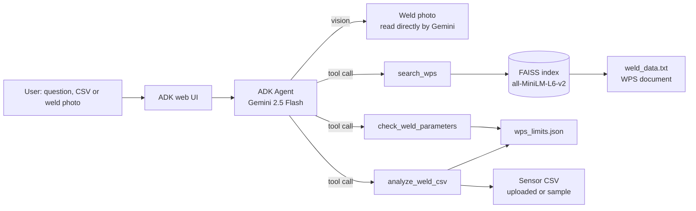

# Weld Quality Agent

A welding quality assistant built with Google's **Agent Development Kit (ADK)** and **Gemini 2.5 Flash**. A welding engineer can ask what the welding procedure specification (WPS) says, check actual current/voltage/travel speed against the WPS limits, get out-of-range flags from a sensor log, or upload a weld photo and have visible defects compared against the WPS acceptance criteria. Every WPS fact in an answer comes from a tool call (FAISS retrieval or a limits lookup), never from the model's memory, and the agent says so when the data is not on file.

**Live demo:** _not deployed yet_

---

## Architecture



The agent is one `Agent` object ([weld_agent/agent.py](weld_agent/agent.py)). Gemini decides which tool to call; ADK runs the Python function and sends the result back to Gemini, which writes the answer from that result.

## Tools

| Tool | What it does |
|---|---|
| `search_wps(query)` | Semantic search over the WPS document. One chunk per WPS section, embedded with `all-MiniLM-L6-v2`, stored in FAISS. Returns the top 3 sections with a source reference such as `weld_data.txt > PREHEAT AND INTERPASS`. |
| `check_weld_parameters(wps_id, weld_pass, current, voltage, travel_speed)` | Compares actual values with the min/max for that pass in `wps_limits.json` and returns PASS/FAIL per parameter. |
| `analyze_weld_csv(file_name, wps_id, weld_pass)` | Mean/min/max/std of current and voltage from a sensor log, plus the count and timestamps of samples outside the WPS range. Works on an uploaded CSV or the built-in `sample_weld_log.csv`. |
| Weld photo (no tool) | Gemini is multimodal, so it reads an uploaded photo directly, describes visible defects, then calls `search_wps` for the acceptance criteria. |

The WPS, the limits and the sample log are synthetic demo data.

## Example queries

_To be added from real runs of the agent._

## Run it locally

Needs Python 3.10+ and a Gemini API key from [Google AI Studio](https://aistudio.google.com/apikey).

```bash
git clone https://github.com/the-anand-sharma/Weld_Assistant_RAG_Based.git
cd Weld_Assistant_RAG_Based
python -m venv .venv
.venv\Scripts\activate          # macOS/Linux: source .venv/bin/activate
pip install -r weld_agent/requirements.txt pytest
```

Create a `.env` file in the project root (it is git-ignored):

```
GOOGLE_API_KEY=your_key_here
```

Then:

```bash
pytest          # tool tests, no API key needed
adk web         # open http://localhost:8000 and pick weld_agent
```

## Deployment

The [Dockerfile](Dockerfile) runs the ADK web UI in a container. The API key is never in the repo or the image; it is injected at runtime as a secret.

- **Hugging Face Spaces (free):** create a Docker Space, add `GOOGLE_API_KEY` under Settings > Secrets, and push this repo to the Space.
- **Google Cloud Run:** the same agent folder deploys with ADK's own command, with the key in Secret Manager:

```bash
adk deploy cloud_run --project=PROJECT_ID --region=asia-south1 \
  --service_name=weld-quality-agent --with_ui weld_agent \
  -- --min-instances=0 --max-instances=2 --memory=2Gi \
     --set-secrets=GOOGLE_API_KEY=GOOGLE_API_KEY:1
```

## Project layout

```
weld_agent/
  agent.py            # the ADK agent: model, instruction, tools
  tools.py            # the three tool functions
  requirements.txt
  data/               # WPS document, limits, sample sensor log
tests/test_tools.py   # pytest tests for the tools
Dockerfile
app.py, gemini_vecc.py  # earlier LangChain LCEL / Streamlit versions
```

## About

Built by [Anand Sharma](https://github.com/the-anand-sharma) · [LinkedIn](https://www.linkedin.com/in/anand-sharma-573527133/)
